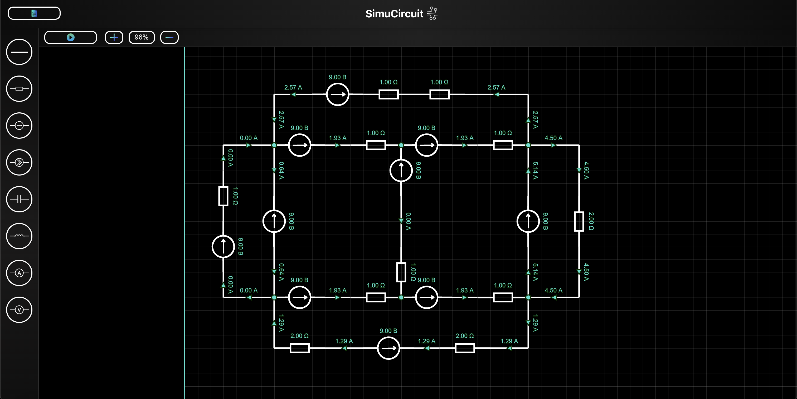

# SimuCircuit

Данное приложение предназначено для моделирования и симуляции электрических цепей.

## Установка

Перейдите в папку `frontend` корневого каталога и установите необходимые зависимости:

```
cd frontend
npm install
```


Далее перейдите в папку `backend`, настройте виртуальное окружение и установите необходимые зависимости:

```
cd ../backend
python3 -m venv venv
source ./venv/bin/activate
pip install -r requirements.txt
```

## Начало работы

В папке `frontend` выполните следующую команду для запуска сервера разработки:

```
npm start
```

Эта команда запустит веб-сервер на http://localhost:3000 (или на другом порту, если порт 3000 уже используется).

В папке `backend/src` выполните следующую команду для запуска бэкенда:

```
uvicorn main:app --host 0.0.0.0 --port 4000 --reload
```

Убедитесь, что бэкенд настроен на использование того же порта и хоста, что указаны в конфигурации фронтенда для обеспечения взаимодействия между ними (настройки указаны в файле `backend/src/main.py`).

## Проверка работы

После запуска фронтенда и бэкенда перейдите по адресу http://localhost:3000 в вашем браузере. Вы должны увидеть интерфейс приложения, который позволяет моделировать и симулировать электрические цепи.

